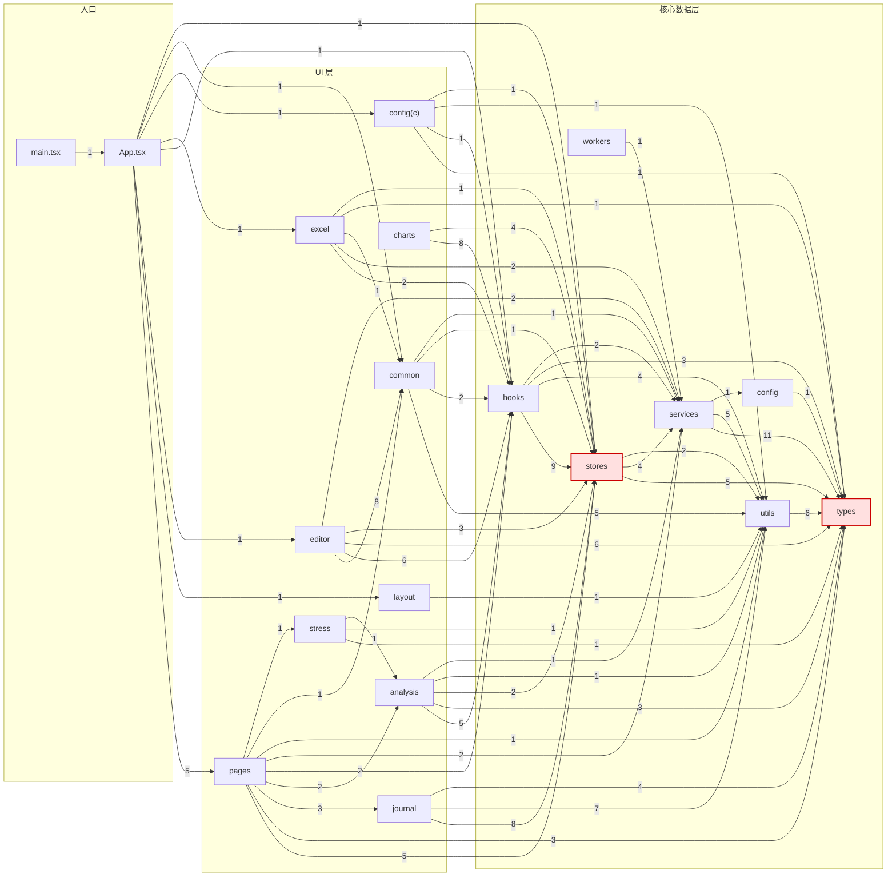

# 依赖关系分析报告

> 生成方式：静态扫描 `src/` 与 `functions/` 下全部 `.ts/.tsx/.js` 文件的 import/export/require 语句，按相对路径与 `@/*` 别名解析为内部模块边，再做强连通分量（Tarjan）与耦合度统计。
> 统计范围：115 个源文件，251 条内部依赖边（不含第三方库）。本报告为**治理后**状态。

## 一、结论摘要

| 指标 | 治理前 | 治理后 |
| --- | --- | --- |
| 循环依赖（文件级） | 0 | **0** |
| 层间双向依赖（模块级） | `hooks` ⇄ `stores` | **0（已消除）** |
| 最高扇入文件 | `types/index.ts`（44） | `types/index.ts`（44） |
| 最高扇出文件 | `DataEditor.tsx`（14） | **`App.tsx`（12）** |

依赖方向已完全单向：`types ← utils ← stores ← hooks ← components ← pages ← App`。

## 二、治理记录（本次已完成）

| 项 | 内容 | 结果 |
| --- | --- | --- |
| 1 | 从 [stores/index.ts](file:///Users/dp/github/trading-review-app/src/stores/index.ts) 移除 `useAnalysisResult / useMonthlyAnalysis` 的反向重导出，消费方改为直接从 [useAnalysis.ts](file:///Users/dp/github/trading-review-app/src/hooks/useAnalysis.ts) 引入 | 模块级双向依赖归零 |
| 2 | 新增 ESLint `no-restricted-imports` 规则，禁止 `src/hooks` 引用 `@/stores` 桶文件（深路径放行），并修复既有违规 | 已用探针验证：桶文件报错、深路径放行 |
| 3 | 新增 [useDataEditor.ts](file:///Users/dp/github/trading-review-app/src/hooks/useDataEditor.ts)，把记录/月度/分析三块编辑与同步逻辑从 [DataEditor.tsx](file:///Users/dp/github/trading-review-app/src/components/editor/DataEditor.tsx) 抽出，组件只保留渲染与视图态 | DataEditor 扇出 14 → 9 |
| 4 | [journalStore.ts](file:///Users/dp/github/trading-review-app/src/stores/journalStore.ts#L7) 的 `@/stores` 桶引用改为深路径 `@/stores/recordsStore` | `src/stores` 目录内桶自引用清零 |

验证：`tsc --noEmit` 通过；`eslint` 无新增问题；依赖复检 `cycles=0`、`bidirectional=[]`。

## 三、循环依赖

**文件级与模块级均为 0。**

原先唯一的隐患是 `src/stores/index.ts` 反向重导出 `../hooks/useAnalysis`，而 hooks 又依赖 stores，构成层间双向依赖。治理 1 已移除该重导出，`stores → hooks` 边归零（见下方依赖图）。

同时，治理 2 通过 ESLint 规则从工具层面锁死了“hooks 只能走深路径”的约定，防止回归。

> 补充：[journalStore.ts](file:///Users/dp/github/trading-review-app/src/stores/journalStore.ts#L7) 原先也从 `@/stores` 桶导入 `useRecordsStore`，现已改为深路径 `@/stores/recordsStore`。至此 `src/stores` 目录内已无任何桶文件自引用，即使将来把 `journalStore` 加入桶导出也不会成环。

## 四、高耦合文件

### 扇入 Top（被最多文件依赖 = 修改影响面大）

| 文件 | 扇入 | 扇出 | 说明 |
| --- | --- | --- | --- |
| [types/index.ts](file:///Users/dp/github/trading-review-app/src/types/index.ts) | 44 | 10 | 全局类型桶，天然中心 |
| [stores/index.ts](file:///Users/dp/github/trading-review-app/src/stores/index.ts) | 18 | 6 | 状态桶（治理后扇入/扇出均下降） |
| [utils/index.ts](file:///Users/dp/github/trading-review-app/src/utils/index.ts) | 13 | 3 | 工具函数桶 |
| [components/common/index.ts](file:///Users/dp/github/trading-review-app/src/components/common/index.ts) | 8 | 5 | 通用组件桶 |
| [useStoreSync.ts](file:///Users/dp/github/trading-review-app/src/hooks/useStoreSync.ts) | 6 | 8 | 同步中枢，依赖 5 个 store + R2 |
| [datasetStore.ts](file:///Users/dp/github/trading-review-app/src/stores/datasetStore.ts) | 6 | 2 | — |

### 扇出 Top（依赖最多 = 最易变、最难测）

| 文件 | 扇出 | 扇入 | 变化 |
| --- | --- | --- | --- |
| [App.tsx](file:///Users/dp/github/trading-review-app/src/App.tsx) | 12 | 1 | 路由装配，属合理中心 |
| [types/index.ts](file:///Users/dp/github/trading-review-app/src/types/index.ts) | 10 | 44 | 类型桶转发 |
| [AnalysisTabsView.tsx](file:///Users/dp/github/trading-review-app/src/components/analysis/AnalysisTabsView.tsx) | 9 | 1 | — |
| [DataEditor.tsx](file:///Users/dp/github/trading-review-app/src/components/editor/DataEditor.tsx) | 9 | 1 | 14 → 9 ✅ |
| [JournalDrafts.tsx](file:///Users/dp/github/trading-review-app/src/components/journal/JournalDrafts.tsx) | 9 | 1 | — |
| [useDataEditor.ts](file:///Users/dp/github/trading-review-app/src/hooks/useDataEditor.ts) | 8 | 1 | 新增，聚合编辑逻辑 |
| [StressTestPage.tsx](file:///Users/dp/github/trading-review-app/src/pages/StressTestPage.tsx) | 8 | 1 | — |

### 双向依赖

无。

## 五、依赖关系图（模块级）

## 六、后续可选项（非本次范围）

1. [App.tsx](file:///Users/dp/github/trading-review-app/src/App.tsx) 扇出 12，主要是路由懒加载装配，属职责使然，可保留。
2. [AnalysisTabsView.tsx](file:///Users/dp/github/trading-review-app/src/components/analysis/AnalysisTabsView.tsx) 与 [JournalDrafts.tsx](file:///Users/dp/github/trading-review-app/src/components/journal/JournalDrafts.tsx) 扇出均为 9，如需进一步解耦可参照本次做法抽取各自的数据逻辑 Hook。
